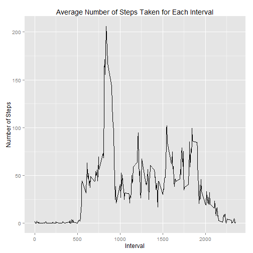

## Loading and preprocessing the data
Load the data and change the class of the variable `date` into Date class using `as.Date()`.

```r
unzip("activity.zip")
activity=read.csv("activity.csv")
activity$date=as.Date(activity$date,"%Y-%m-%d")
```

## What is mean total number of steps taken per day?
**1. Make a histogram of the total number of steps taken each day.**

Use `aggregate()` to count the total number of steps taken per day.

```r
total=aggregate(steps~date,data=activity,sum)
```

Use ggplot2 package to plot the histogram.

```r
library(ggplot2)
ggplot(total,aes(date,steps))+
  geom_histogram(stat="identity")+
  labs(x="Date",y="Number of Steps",title="Total Number of Steps Taken Each Day")
```

 

**2. Calculate and report the mean and median total number of steps taken per day.**

```r
options(digits=7)
mean(total$steps)
```

```
## [1] 10766.19
```

```r
median(total$steps)
```

```
## [1] 10765
```

The mean and median total number of steps taken per day are **10766.19** and **10765**, respectively. 

## What is the average daily activity pattern?
**1. Make a time series plot of the 5-minute interval (x-axis) and the average number of steps taken, averaged across all days (y-axis).**

Use `aggregate()` to count the average number of steps taken in each 5-minute interval, averaged across all days.

```r
average=aggregate(steps~interval,data=activity,FUN="mean")
```

Use ggplot2 package to make the time series plot.

```r
ggplot(average,aes(interval,steps))+
  geom_line()+
  labs(x="Interval",y="Number of Steps",title="Average Number of Steps Taken for Each Interval")
```

 

**2. Which 5-minute interval, on average across all the days in the dataset, contains the maximum number of steps?**

```r
average[which.max(average$steps),]
```

```
##     interval    steps
## 104      835 206.1698
```
Interval 835 contains the maximum number of steps on average across all the days in the dataset.

## Imputing missing values
**1. Calculate and report the total number of missing values in the dataset.**

```r
sum(is.na(activity))
```

```
## [1] 2304
```
There are in total 2304 missing values in the dataset.

**2. & 3. Devise a strategy for filling in all of the missing values in the dataset. **

Take the mean for that 5-minute interval to replace a particular NA, creating a new dataset called `filled`.

```r
filled=activity
for(i in 1:nrow(filled)){
  if(is.na(filled$steps[i])==TRUE){
  filled$steps[i]=mean(filled$steps[which(filled$interval==filled$interval[i])],na.rm=TRUE)
	}
}
```

**4. Make a histogram of the total number of steps taken each day and calculate and report the mean and median total number of steps taken per day. Do these values differ from the estimates from the first part of the assignment? What is the impact of imputing missing data on the estimates of the total daily number of steps?**

Make a histogram of the total number of steps taken each day.

```r
total_filled=aggregate(steps~date,data=filled,sum)
ggplot(total_filled,aes(date,steps))+
  geom_histogram(stat="identity")+
  labs(x="Date",y="Number of Steps",title="Average Number of Steps Taken Each Day (NAs Filled)")
```

 


```r
mean(total_filled$steps)
```

```
## [1] 10766.19
```

```r
median(total_filled$steps)
```

```
## [1] 10766.19
```
The mean and median total number of steps taken per day are both **10766.19**. Mean values are the same before and after imputing, but median increased after imputing (**10765** to **10766.19**). Imputing could lead to bias, but in this case the impact seems to be limited.

## Are there differences in activity patterns between weekdays and weekends?
**1. Create a new factor variable in the dataset with two levels - "weekday" and "weekend" indicating whether a given date is a weekday or weekend day.**

The new factor variable is called `day`.

```r
for(i in 1:nrow(filled)){
  if(weekdays(filled$date[i]) %in% c("Saturday","Sunday")){filled$day[i]="weekend"}
  else{filled$day[i]="weekday"}
}
```

**2. Make a panel plot containing a time series plot of the 5-minute interval (x-axis) and the average number of steps taken, averaged across all weekday days or weekend days (y-axis).**

```r
average_by_day=aggregate(steps~interval+day,data=filled,FUN="mean")

ggplot(average_by_day,aes(interval,steps))+
  geom_line()+
  facet_grid(day~.)+
  labs(x="Interval",y="Number of Steps",title="Average Number of Steps Taken for Each Interval on Weekdays and Weekends")
```

 
